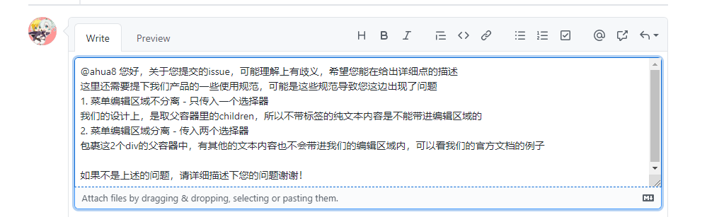
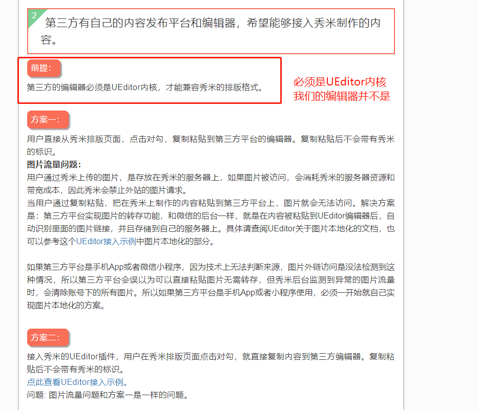
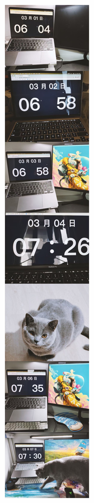
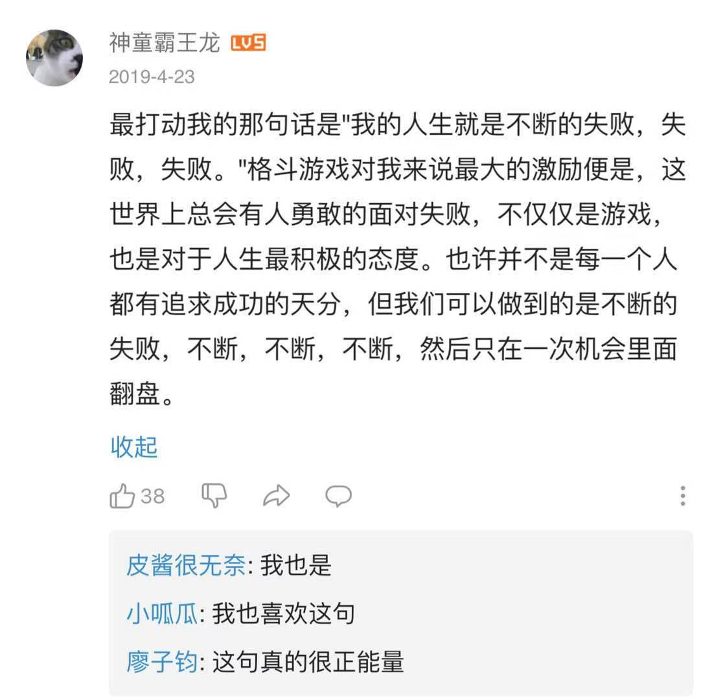
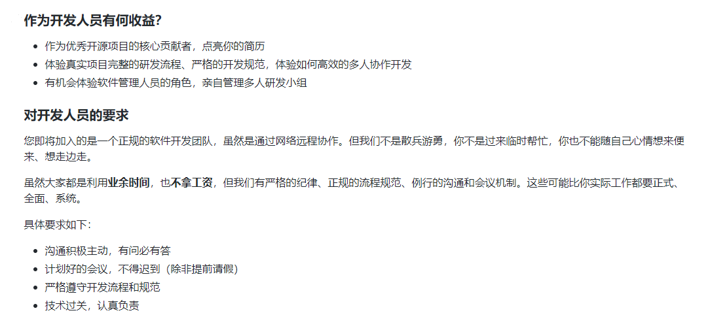
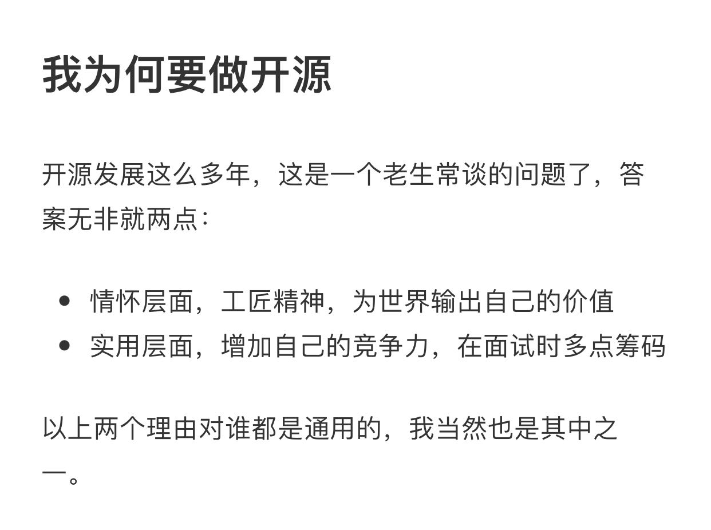
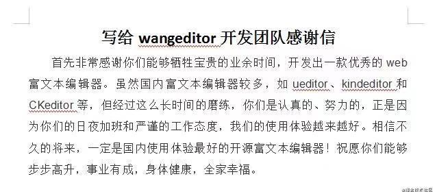

# 加入开源团队 wangEditor 之任务记录及参后感

大家好，我依然是你们的萌新朋友，梅利奥猪猪，今天是来水一篇文章的，就如标题所示，前方友情提示，这里是大型水文章现场，现在关闭还来得及！

## 任务记录

### [菜单和编辑区域分离设置默认内容](<(https://github.com/wangeditor-team/wangEditor/issues/3000)>)

这个任务，其实是个很简单的任务，我花了比较久的时间，主要跑偏了个点，这个跑偏的点对萌新可以说是干货，但并不是这个 bug 真正要修复的东西，后面我会详细的讲，先来看以下代码

```html
<div class="wrap">
  <p>这是个p标签</p>
  这里的文字没在标签里
  <p>这也是个p标签</p>
</div>
```

大家觉得用户在默认的文本区域`class="wrap"`的**div**内，设置了这些内容，会不会带入编辑器，不管是说带入还是说没带入其实都是错的，答案是带入了一部分，没标签的内容并没有带到实际的编辑区域内，因为我们的源码中，只获取了`children`，什么，你们不知道为什么 children 拿不到纯文本内容**这里的文字没在标签里**，不要担心，我一开始也有点忘记了哈哈，可以看下[MDN-children](https://developer.mozilla.org/zh-CN/docs/Web/API/ParentNode/children)，有这么一个描述**返回 一个 Node 的子 elements ，是一个动态更新的 HTMLCollection。**，所以纯文本并取不到，要通过 childNodes 去取，这个就可以拿到对应的文本节点，但又会有其他的问题，比如返回的是个**NodeList**，这个和之前的区别就是一个是动态更新的，一个是快照，然后纯文本我们带入编辑器也需要套上标签等等。总之重构可能会带来各种问题。然后我就与老大讨论了下，结果得出的结论是，如果是纯文本不能带入的问题，我们就不做处理了。因为我们有自己的使用规范，而用户提的类似的这种需求(当时理解用户提的 bug 不能把内容带进编辑器以为是这种场景)，相当于是自己定制化的需求，我们并不应该去帮忙实现，而且纯文本套个标签就这么懒嘛，不能太宠用户 balabala，我其实觉得还是挺有道理的，于是回复了用户，并等待回复！



然后过了一阵子，团队另外个大佬试出了真相，其实是我们菜单编辑区域分离，分离后的编辑区域设置默认的内容，就算是带标签的也没有带入编辑器。那这肯定就是我们的问题了，这怎么能忍，怎么可以让用户受这样的委屈！分分钟处理好了这个 bug。截取部分修复的逻辑给大家看下

```ts
    if (textSelector == null) {
        ...
    } else {
        // toolbarSelector 和 textSelector 都有
        $toolbarSelector.append($toolbarElem)
        // 菜单分离后，文本区域内容暂存
        $subChildren = $(textSelector).children() // new
        $(textSelector).append($textContainerElem)
        // 将编辑器区域原有的内容，暂存起来
        $children = $textContainerElem.children()
    }

    ...

    // 菜单分离后，文本区域有标签的带入编辑器内
    if ($subChildren && $subChildren.length) {
        $textElem.append($subChildren)
        // 编辑器有默认值的时候隐藏placeholder
        $placeholder.hide()
    }
```

所以最终第一个任务就这么完成了，我也在这个任务中第一次为开源团队贡献了代码！

### [秀米和编辑器的适配和接入](https://github.com/wangeditor-team/wangEditor/issues/2803)

这是个调研任务，是个硬骨头，那为什么我完成了这个任务呢，因为实现成本太高，调研后应该就直接pending了，哈哈具体我还要在团队输出调研后的文档，不过是在语雀输出，这边就在这篇水文章大概讲下调研后的结果

首先我简单去了解了下百度编辑器，毕竟用户说了，秀米在百度编辑器中使用没问题，但在我们编辑器里就各种表现形式不一致，还是那句话，怎么能让用户受委屈呢！我就赶紧试了试，外加也看了下百度编辑器中有没有关于接入秀米的文档。结果貌似撒都没找到，也发现了我们的编辑器对秀米的确支持不好(哭哭唧唧)。那再去秀米官网看看？功夫不负有心人，在秀米官网的底部看到了**第三方对接秀米**，这不就是我想要找的嘛！激动，于是点进[链接](https://r.xiumi.us/board/v5/2a5va/16516964)，看到了这个



之后嘛，就是继续和老大讨论呗，结果结论就是相对实现成本比较高，就先pending。所以第二个任务也就告段落，也算轻松完成了调研任务，调研了相关可行性。

## 参后感

### 年轻人不讲武德


作为 90 后又老又菜的咸鱼，为什么会把这个列在参后感第一条，那必须是感受太强烈了。因为加入团队后，看到团队成员里还有没有毕业的大佬，有很多工作 1 年也没到的大佬！这些年轻人我的妈呀！oh my god！技术又强，又自律，又爱学习，我在他们这个年纪的时候，那真的是咸鱼，太自愧不如了（上次好像写了篇文章也大概提到了这个- -）！然后带我熟悉流程的 61 大佬，就是才工作半年的大佬，比我早加入一个月，是个每天都会早起学习的不讲武德的年轻人(在他的感染下，我现在也比平时起的早一丢丢，刚刚开启了自律的早起学习生活)。哈哈我偷了他朋友圈的图，大家感受下！



不管怎么说，一个人能长期坚持做一件事情，哪怕是打游戏，我都觉得是很厉害，是值得尊敬的强者，比如日本格斗电竞的职业选手[梅原大吾](https://www.bilibili.com/video/BV13b411G7bB?from=search&seid=1176602793208406247)，也是这样，努力坚持学习就是他们最强的天赋。所以我也给自己定了这样的目标(不是强者那也要向强者学习先模仿起来)！在自己游戏荒的时候，天天早起撸会码，然后有自己想玩的游戏的时候，早起劳逸结合打会游戏不香嘛（滑稽脸，我真是个小天才），再来一张鸡汤图，来自网友对梅原大吾介绍的评价截图



### 萌新之瑟瑟发抖


哎，这个也是我感受很深的，真希望自己能早点变强。团队里有的大佬真的一天几个任务几个 issue，做完了立马接新的 issue，而我却是 n 天一个 issue，并在角落瑟瑟发抖，观摩大佬学习大佬。不过我们的开源团队非常和谐，大佬们都很 nice，很温油，指导的很耐心，常常在我抖的非常厉害的时候，在我黑暗的前行的道路上点盏明灯。所以现在我也算是熟悉了团队的一些基本的流程，在撸码的时候思路也变清晰点了吧，与大佬们一起努力，让我们的产品变得更好吧！

### 实现梦想体现自我价值的地方


我们团队的目标，一直都是官网示例的第一句话`争做国内使用体验Z好的开源 Web 富文本编辑器！`，可能各位看客，会觉得是不是你们开源会有很多收入，你们是怎么坚持下来的这样的问题。首先我们是没有收入的，大家都是靠自驱去学习，去做好这么个产品。然后我觉得每一个成员（包括我），都想提高自己的技术、让 wangEditor 有更多人的去使用、得到同行的认可，也能增加自己的竞争力，体现自己的技术价值。最后我就放几张截图，是来自我们的文档，我们老大的掘金文章，以及用户的一些反馈(偷图偷来的)，正是这些，汇集了无穷无尽的力量，能让我们继续努力的为开源事业做出奋斗！






