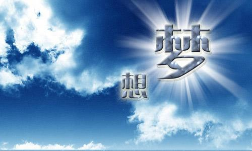

# 加入开源团队wangEditor之参后感

大家好，我依然是你们的萌新朋友，梅利奥猪猪，今天是来水一篇文章的，就如标题所示，之后会以下面列举的几点展开，前方友情提示，这里是大型水文章现场，现在右上角关闭还来得及！

1. 年轻人不讲武德

2. 瑟瑟发抖

3. 实现梦想体现自我价值的地方

4. 自己目前为止的贡献

## 年轻人不讲武德

作为90后又老又菜的咸鱼，为什么会把这个列在第一条，那必须是感受太强烈了。因为加入团队后，团队成员里有还没有毕业的大佬，有很多工作1年也没有的大佬！这些年轻人我的妈呀！oh my god！技术又强，又自律，又爱学习，我在他们这个年纪的时候，那真的是咸鱼，太自愧不如了！然后带我熟悉团队的61大佬，就是才工作半年的大佬，比我早加入一个月，是个每天都会早起学习的不讲武德的年轻人(在他的感染下，我现在也比平时起的早一丢丢，刚刚开启了自律的早起学习生活)。哈哈我偷了他朋友圈的图，大家感受下！

## 瑟瑟发抖

## 实现梦想体现自我价值的地方

## 自己目前为止的贡献

