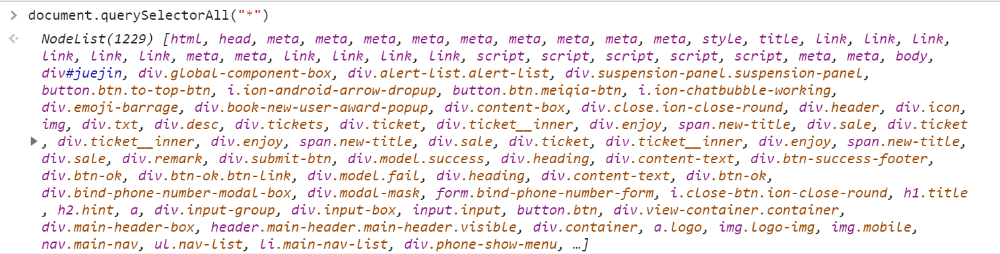
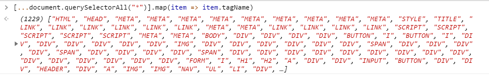
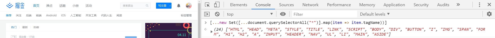
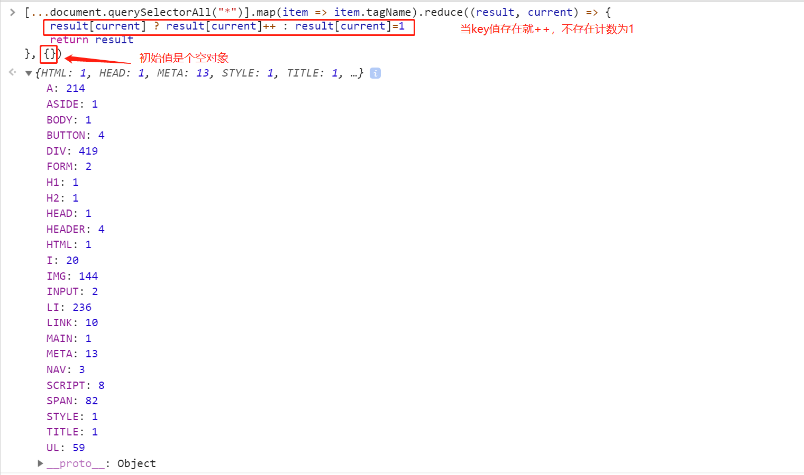
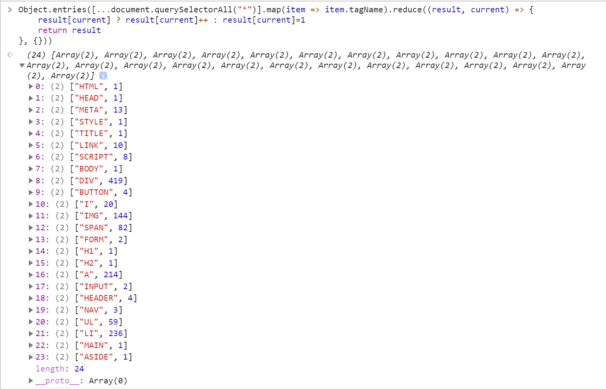
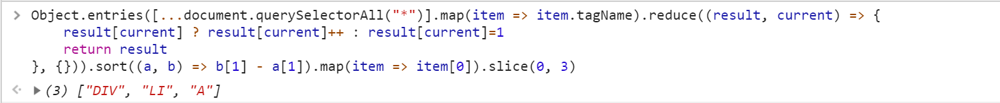

# 来数页面元素啦

## 前言尬聊

距离上一次写的文章间隔已经有段时间了，没想到随手的一次笔记分享，还拿到了几个赞(原本以为应该是没人看没阅读量的)，谢谢大家的鼓励，所以就有动力肝这一篇文章了。其实作为萌新，感觉提高自己的方式就是坚持学习，持续的学习，多写写技术相关的文章，萌新都是潜力股啊，因为撒都不会，学到了什么温故了什么记录了什么就是一次成长！所以今天记录的题目就是如标题，好了我成长了，那就撤了，大家自己脑补下面试题吧！88！(被众人一顿狂揍，好好好，我回来，来讲正题了)

## 考题

正如标题所说的这样，这次的面试题分享，就是数页面元素，考察的点依然是基础，先上题目

1. 掘金首页一共有多少元素，共有几种不同的元素
2. 掘金首页出现次数最多的top3的元素是什么

## 解题

### 第一题 - 热身用

一个页面一共有多少元素，想必这个初学者都会，我们不是有个通配符`*`嘛，配合我们的`querySelectorAll`，在掘金首页打开开发者工具，随手一敲，飒！

众所周知，NodeList并不是数组，里面的每个Node都是个对象，为了拿到标签名，我们可以使用map，但这里直接map就会报错哦~

那之后的数组去重，不用说大家都会，直接用Set就可以了！

上图所示答案不就出来了，原来掘金一共用了24种元素，当然面试官考到这个一共有多少种，我们还是要规范点，在前面的代码上加上`.length`，这样第一题就大功告成！哈哈是不是道很基础的题，虽然很简单，但还是考察了一些知识点的，下一道top3的题就更有意思了，但其实也不难，听我娓娓道来~

### 第二题

还记得我们前面的`[...document.querySelectorAll("*")].map(item => item.tagName)`获取了页面所有元素的标签名嘛，在此基础上做个统计而已，这个时候我们的reduce就登场了

我们统计好了，但如何方便的排序呢，好像给对象排序不是特别方便吧，肯定转成数组会方便些吧，sort下美滋滋啊，所以我们这个时候又可以借助`Object.entries`

之后sort，map，slice一顿操作猛如虎，就完成第二题了

果然和猜的差不多啊，`div`, `li`, `a`必然是前三啊~

## 总结

虽然这次题目很基础，但涉及到的知识点，一些api不算多也不算少，不清楚的萌新可以查缺补漏，我也会和诸位萌新共同成长~当然如果有更方便的解题思路，大家可以一起讨论哈，这里是梅利奥猪猪，谢谢大家支持鼓励~