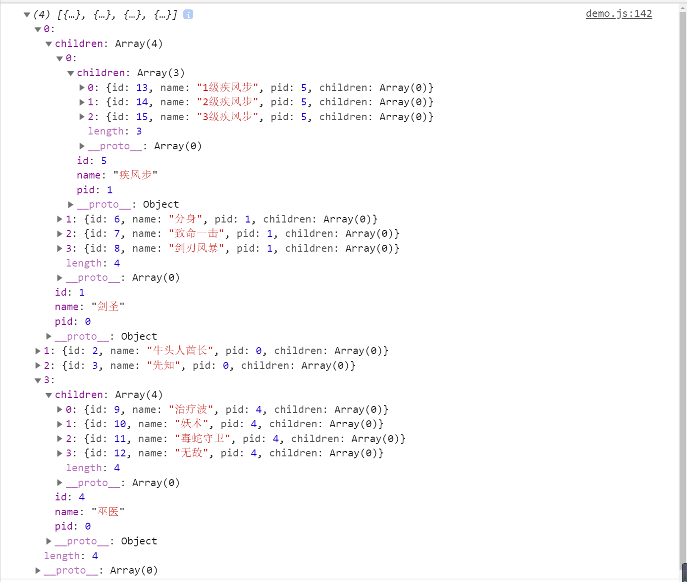

# 玩耍JS树状结构数据 

## 背景

最近有朋友说面试碰到了些树状数据结构渲染，还有在Vue和React中该怎么写树状组件的问题，恰巧作为菜逼的我以前有整理过一些题，还有自己的练习，先分享一波，有问题的小伙伴可以一起探讨

## 題目

### 概述

* 这边的数据，就拿我们当年的童年，war3举例子
* 本人之前一直玩的是兽族，四个英雄，各列举了点技能
* 然后就愉快的做题吧

### 练习

* 先来看下数据格式

  ```js
  let list = [
      {
          id: 0,
          name: "兽族英雄技能",
          pid: -1
      },
      {
          id: 1,
          name: "剑圣",
          pid: 0
      },
      {
          id: 2,
          name: "牛头人酋长",
          pid: 0
      },
      {
          id: 3,
          name: "先知",
          pid: 0
      },
      {
          id: 4,
          name: "巫医",
          pid: 0
      },
      {
          id: 5,
          name: "疾风步",
          pid: 1
      },
      {
          id: 6,
          name: "分身",
          pid: 1
      },
      {
          id: 7,
          name: "致命一击",
          pid: 1
      },
      {
          id: 8,
          name: "剑刃风暴",
          pid: 1
      },
      {
          id: 9,
          name: "治疗波",
          pid: 4
      },
      {
          id: 10,
          name: "妖术",
          pid: 4
      },
      {
          id: 11,
          name: "毒蛇守卫",
          pid: 4
      },
      {
          id: 12,
          name: "无敌",
          pid: 4
      },
      {
          id: 13,
          name: "1级疾风步",
          pid: 5
      },
      {
          id: 14,
          name: "2级疾风步",
          pid: 5
      },
      {
          id: 15,
          name: "3级疾风步",
          pid: 5
      }
  ];    
  ```

* 完成以下题目

  * 根据id获取对应的数据

  * 根据id获取它的父亲

  * 根据id获取它的孩子节点

  * 根据id获取它所有的上级节点(父，爷...)

  * 根据id获取它所有的下级节点(孩子，孙子...)

  * 根据给定的list生成树状结构，类似下图

       


## 答案

### 获取自身

  ```js
  function getSelf(list, id){
      return list.filter(item => item.id === id)[0];
  }
  
  // console.log(getSelf(list, 15));    
  ```

### 获取父亲

  ```js
  function getParent(list, id){
      let self = getSelf(list, id);
      return getSelf(list, self.pid);
  }
  
  // console.log(getParent(list, 15));    
  ```

### 获取孩子

  ```js
  function getChildren(list, id){
      return list.filter(item => item.pid === id);
  }
  
  // console.log(getChildren(list, 5));    
  ```

### 获取上级(父亲，爷爷...)

  ```js
  function getAllParent(list, id){
      let parent = getParent(list, id);
      let result = [];
      while(parent){
          result.unshift(parent);
          parent = getParent(list, parent.id);
      }
      return result;
  }    
  ```

### 获取下级(孩子，孙子...)

  ```js
  function getAllChildren(list, id){
      let children = getChildren(list, id);
      let result = [].concat(children);
      children.forEach(child => {
          result = result.concat(getChildren(list, child.id));
      })
      return result;
  }
  
  // console.log(getAllChildren(list, 1));
  ```

### 列表转树状 - 递归实现

  ```js
  function list2Tree(list, pid){
      let len = list.length;
      function loop(pid){
          let res = [];
          for(let i = 0; i < len; i++){
              let item = list[i];
              if(item.pid === pid){
                  item.children = loop(item.id);
                  res.push(item);
              }
          }
          return res;
      }
      return loop(pid);
  }
  
  console.log(list2Tree(list, 0));    
  ```

## Vue和React树组件

### Vue的树组件小案例

```html
<!DOCTYPE html>
<html lang="en">
  <head>
    <meta charset="UTF-8" />
    <meta name="viewport" content="width=device-width, initial-scale=1.0" />
    <title>Tree demo</title>
  </head>
  <body>
    <div id="app">
      <h1>{{ title }}</h1>
      <ul>
        <items v-for="model in treeData" :key="model.id" :model="model"></items>
      </ul>
    </div>
    <script src="https://cdn.bootcss.com/vue/2.6.11/vue.min.js"></script>
    <script>
      Vue.component('items', {
        props: ['model'],
        name: 'items',
        template: `
          <li @click.stop="toggle">
            <span>{{ model.title }}</span>  
            <ul v-if="hasChildren" v-show="open">
              <items v-for="item in model.children" :key="item.id" :model="item" />
            </ul>  
          </li>
        `,
        data () {
          return {
            open: true,
          }
        },
        computed: {
          hasChildren () {
            return this.model.children && this.model.children.length
          }
        },
        methods: {
          toggle () {
            if (this.hasChildren) {
              this.open = !this.open
            }
          }
        }
      })
      const vm = new Vue({
        el: "#app",
        data: {
          title: "tree demo",
          treeData: [
            {
              id: 1,
              title: "node-1",
              children: [
                {
                  id: 2,
                  title: "node-2",
                  children: [
                    {
                      id: 3,
                      title: "node-3"
                    },
                    {
                      id: 4,
                      title: "node-4"
                    },
                    {
                      id: 5,
                      title: "node-5"
                    }
                  ]
                }
              ]
            }
          ]
        }
      });
    </script>
  </body>
</html>
```

### React树组件小案例

```js
import React, { Component } from "react";

const treeData = {
  title: "总览",
  key: "big-title",
  children: [
    {
      title: "0-0",
      key: "0-0",
      children: [
        {
          title: "0-0-0",
          key: "0-0-0",
          children: [
            { title: "0-0-0-0", key: "0-0-0-0" },
            { title: "0-0-0-1", key: "0-0-0-1" },
            { title: "0-0-0-2", key: "0-0-0-2" },
          ],
        },
        {
          title: "0-0-1",
          key: "0-0-1",
          children: [
            { title: "0-0-1-0", key: "0-0-1-0" },
            { title: "0-0-1-1", key: "0-0-1-1" },
            { title: "0-0-1-2", key: "0-0-1-2" },
          ],
        },
        {
          title: "0-0-2",
          key: "0-0-2",
        },
      ],
    },
    {
      title: "0-1",
      key: "0-1",
      children: [
        { title: "0-1-0-0", key: "0-1-0-0" },
        { title: "0-1-0-1", key: "0-1-0-1" },
        { title: "0-1-0-2", key: "0-1-0-2" },
      ],
    },
    {
      title: "0-2",
      key: "0-2",
    },
  ],
};

class TreeNode extends Component {
  constructor(props) {
    super(props);
    this.state = {
      isOpen: false,
    };
  }
  get isFolder() {
    return this.props.treeData.children && this.props.treeData.children.length;
  }
  toggle = () => {
    this.setState({
      isOpen: !this.state.isOpen
    })
  }
  render() {
    return (
      <ul>
        <li>
          <div style={{cursor: 'pointer'}} onClick={this.toggle}>
            {this.props.treeData.title}
            <span>
              {this.isFolder ? (this.state.isOpen ? " -" : " +") : null}
            </span>
          </div>
          {this.isFolder ? (
            <div style={{ display: this.state.isOpen ? "block" : "none" }}>
              {this.props.treeData.children.map((item) => (
                <TreeNode treeData={item} key={item.key} />
              ))}
            </div>
          ) : null}
        </li>
      </ul>
    );
  }
}

class TreeTest extends Component {
  constructor(props) {
    super(props);
  }
  render() {
    return (
      <div>
        <h1>Tree Demo</h1>
        <TreeNode treeData={treeData} />
      </div>
    );
  }
}

export default TreeTest;
```